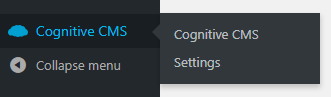
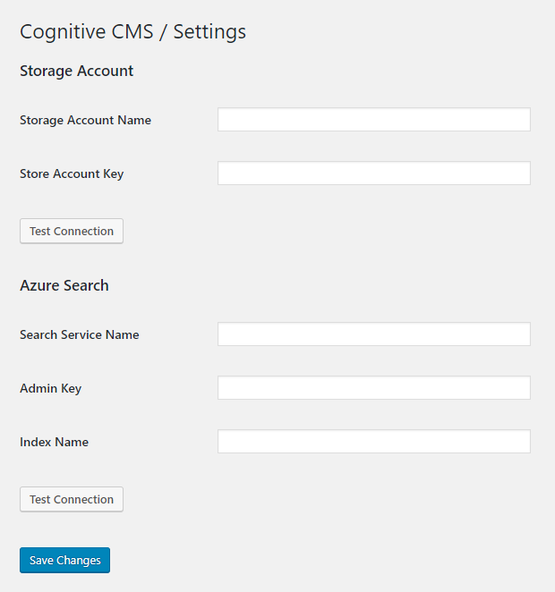
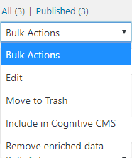
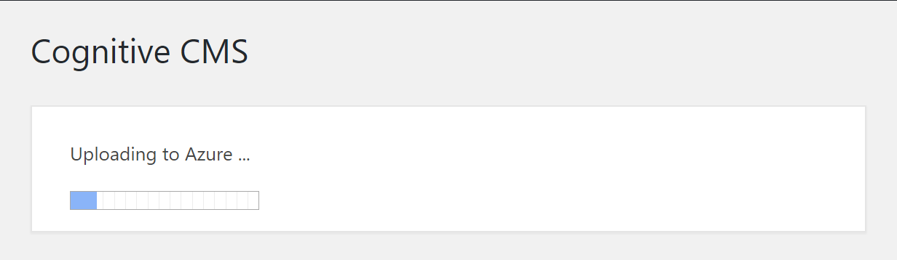
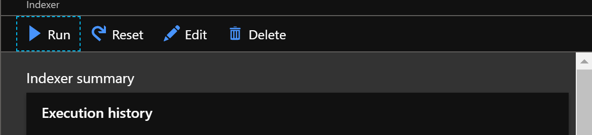
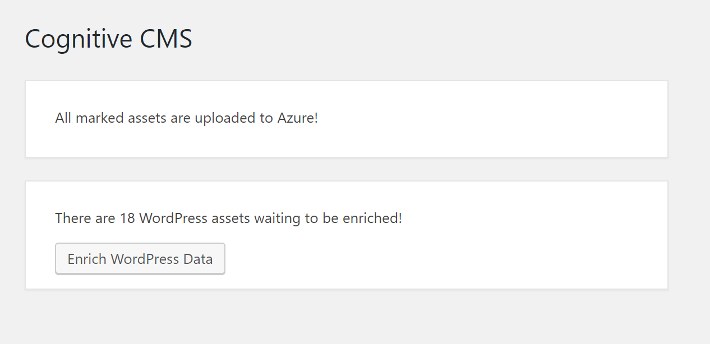
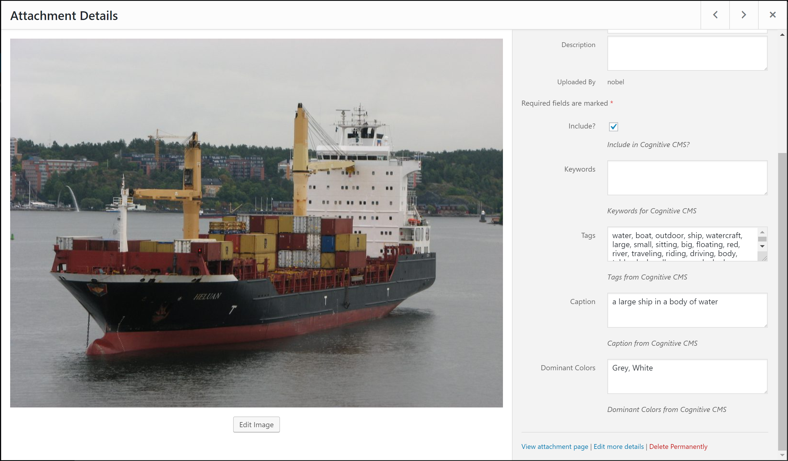
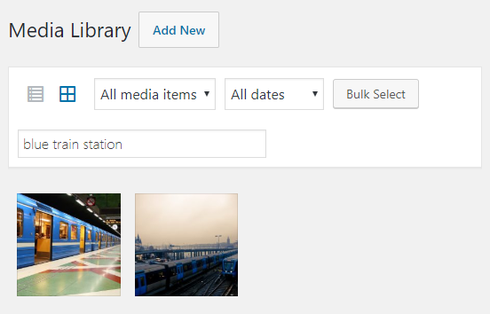

# Welcome to the CognitiveCMS! 🧠☁️🤯

This repository contains two projects
  * deployment - Azure deployment script which is used to quickly setup required azure resources
  * cognitive-cms - WordPress Plugin that connects to Azure resources and enriches your data

## What is CognitiveCMS?

If you want to try out how Cognitive Search works and what are the benefits, this repository contains everything you need to get started.

This solution in an effort to bring these ideas closer to where a lot of internet data is - WordPress. With this simple plugin you will be able to try Microsoft's latest Cognitive Services together with Azure Search.

We chose the open source route because we wanted to lower the entrance barrier to this great technologies. It is also easy to extend every part of this solution, so you can customize it to fit your own needs.

This is build on top of [LearnAI-Cognitive-Search](https://github.com/ikivanc/LearnAI-Cognitive-Search) by Ibrahim Kivanc.

## Setup

If you don't have an Microsoft Azure subscription, you can get one [for free](https://azure.microsoft.com/en-us/free/)!

The idea is that you would just run ```Start.ps1``` and all the resources would be setup and configured. However, there are some prerequisites.

Make sure that you have [Azure PowerShell](https://docs.microsoft.com/en-us/powershell/azure/) installed together with [Az.Search PowerShell Module](https://docs.microsoft.com/en-us/powershell/module/az.search/). You might have to uninstall the previous version of AzureRM, and to help you with that there is a script under ```misc/UninstallAzureRmModules.ps1```

After that, just open the code in [Visual Studio Code](https://code.visualstudio.com/), open ```Start.ps1``` and press ```F5```. The output you get once the script is finished is needed to configure the WordPress Plugin.

## WordPress plugin

To get started with the WordPress plugin, just copy the ```/cognitive-cms``` folder to your WordPress instance under ```/wp-content/plugins``` or upload as a zip file.

Once you activate the plugin, you will see that is shows up in the menu.



The next step would be to configure the plugin in the settings page with the output from the deployment script.



After that, you have to ability to bulk include your assets in CognitiveCMS.



Once you have included the assets you want to enrich, going back to the CognitiveCMS Dashboard will offer you to upload the assets to Azure.



After the upload is done, you will have to wait a bit for the Cognitive Search pipeline to run. You can speed up this process by manually triggering the indexer.



CognitiveCMS Dashboard will now offer you to save the enriched data back to WordPress.



In your Media assets you will see Tags, Caption and Dominant Colors fields populated by what was generated by Cognitive Search.



Thanks to CognitiveCMS plugin, you will be able to search through your assests by these new AI generated keywords.

